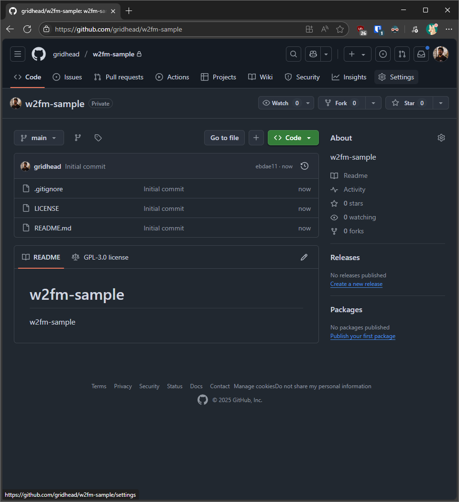
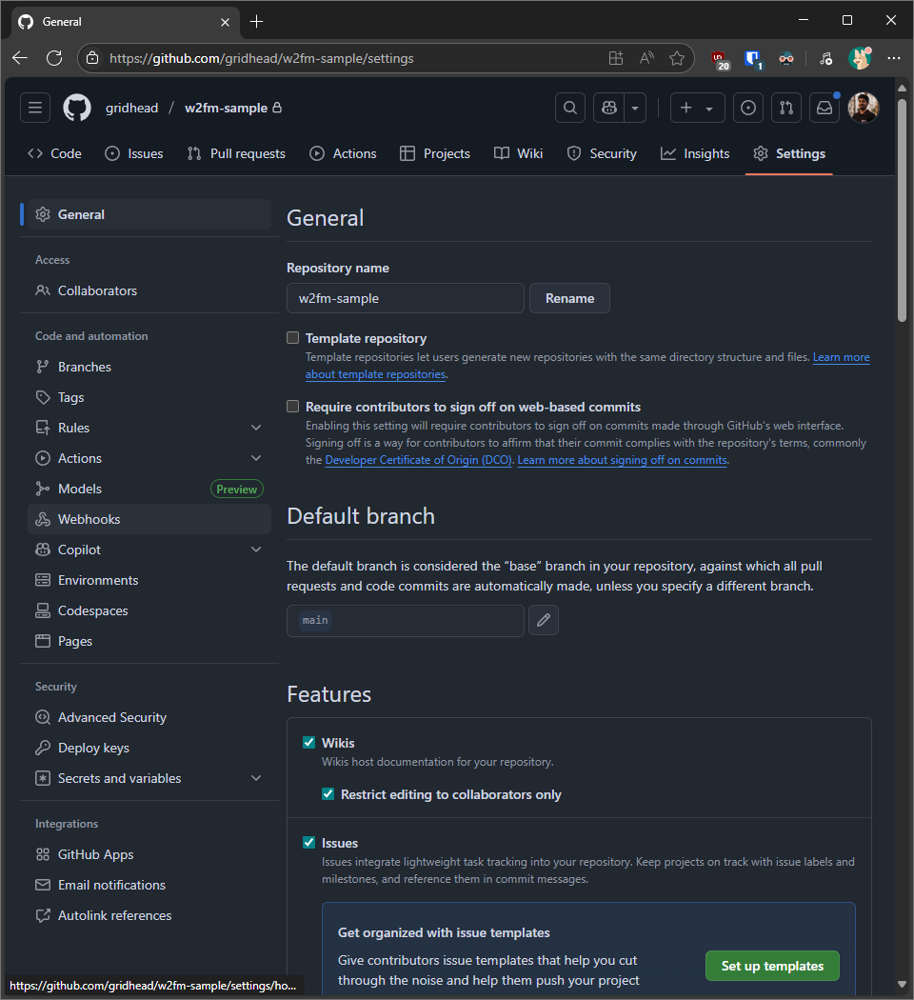
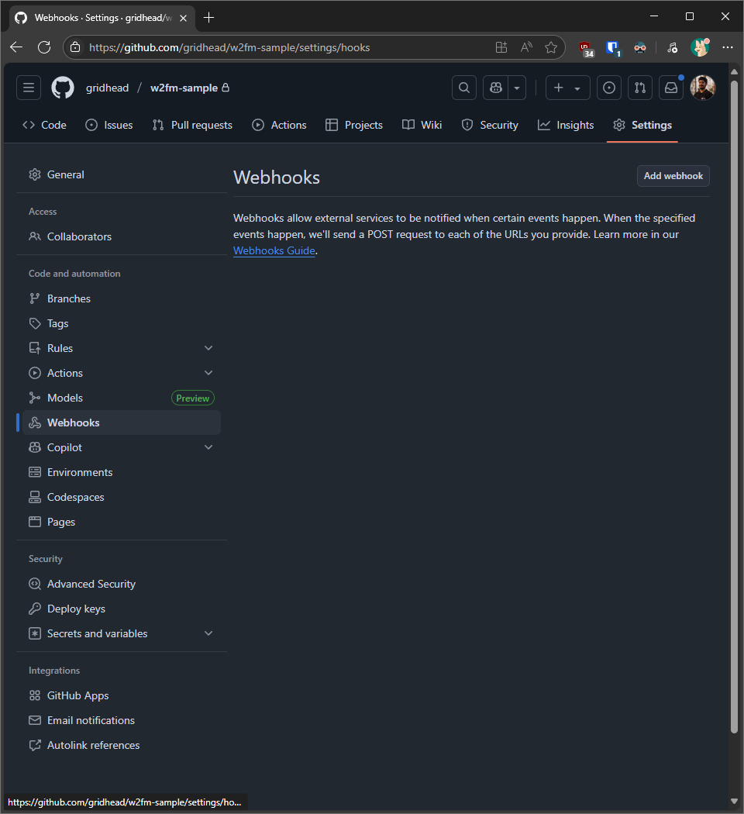
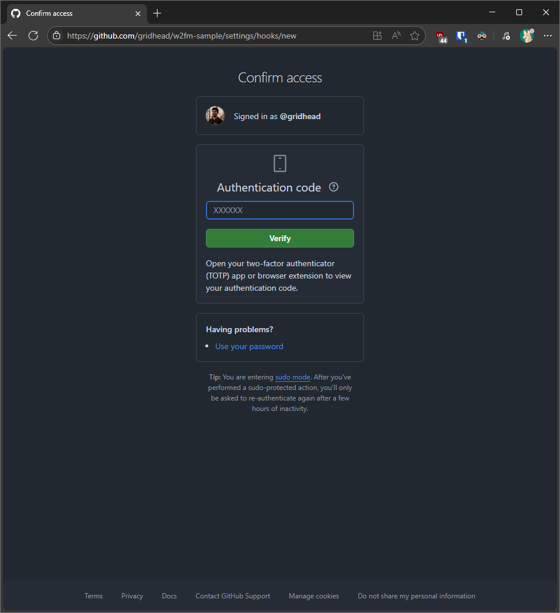
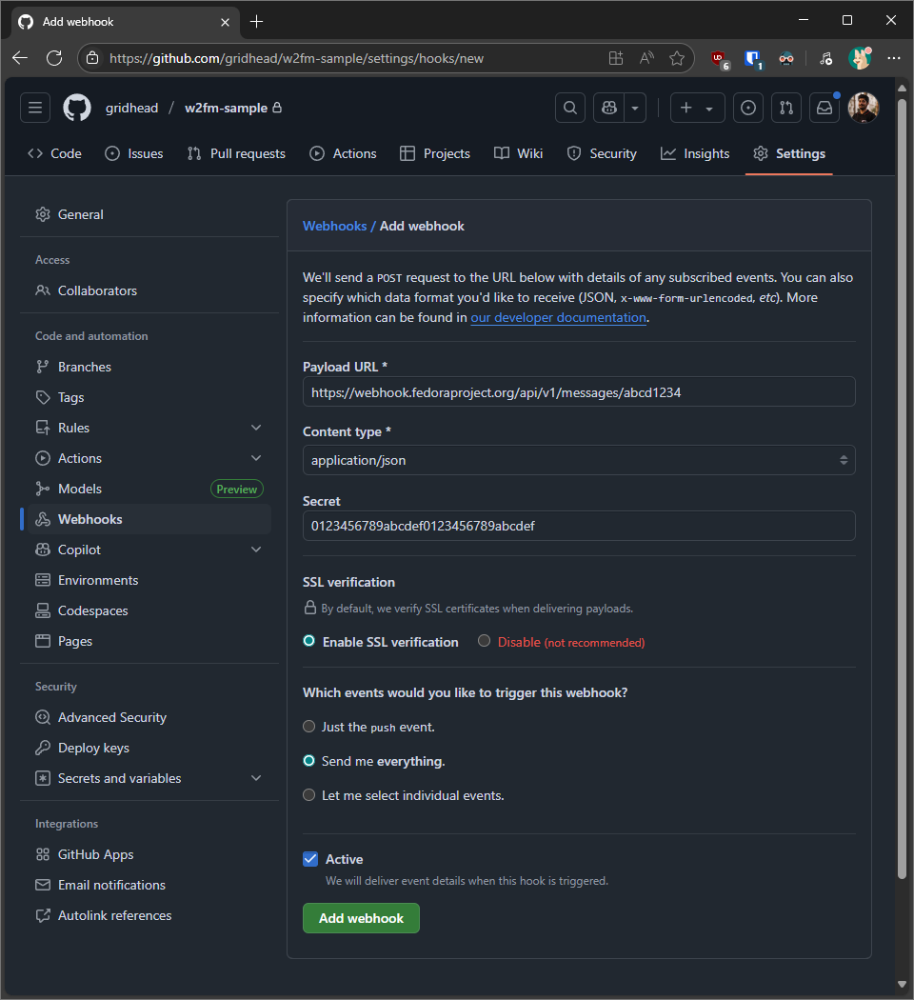
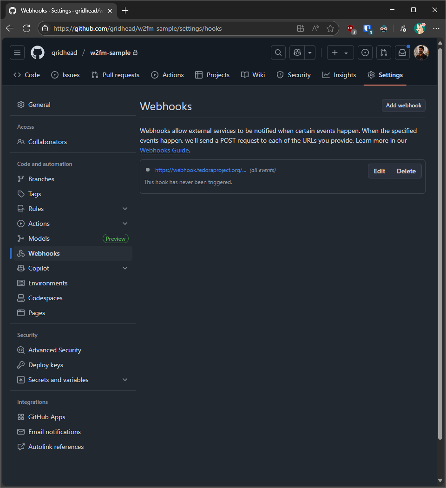

This documentation will explain how one can quickly establish events from a
GitHub repository to be conveyed to the Fedora Messaging bus.

1. Create a webhook bind under the type **GitHub** on the dashboard with
   a unique name and an appropriate description.

2. Navigate to the project repository on **GitHub**.  
   

3. On the **Settings** page, navigate to the **Webhooks** section.  
   

4. Click on the **Add webhook** button to begin.  
   

5. Reauthenticate yourself to **GitHub** if required.  
   

6. Fill the information accurately from the created webhook bind.  
   

7. After saving, the webhook bind should be enabled.  
   

8. Perform one of the following actions for triggering the events.
   1. Push (Events catalogued under the [`org.fedoraproject.prod.github.push`](https://apps.fedoraproject.org/datagrepper/v2/search?topic=org.fedoraproject.prod.github.push) topic)
   2. Pull request (Events catalogued under the [`org.fedoraproject.prod.github.pull_request`](https://apps.fedoraproject.org/datagrepper/v2/search?topic=org.fedoraproject.prod.github.pull_request) topic)
   3. Issue ticket (Events catalogued under the [`org.fedoraproject.prod.github.issues`](https://apps.fedoraproject.org/datagrepper/v2/search?topic=org.fedoraproject.prod.github.issues) topic)
   4. Issue comment (Events catalogued under the [`org.fedoraproject.prod.github.issue_comment`](https://apps.fedoraproject.org/datagrepper/v2/search?topic=org.fedoraproject.prod.github.issue_comment) topic)
